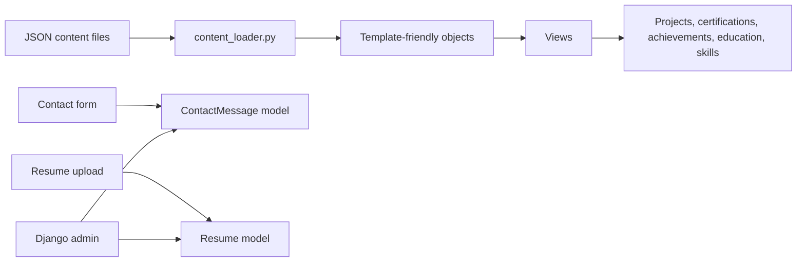
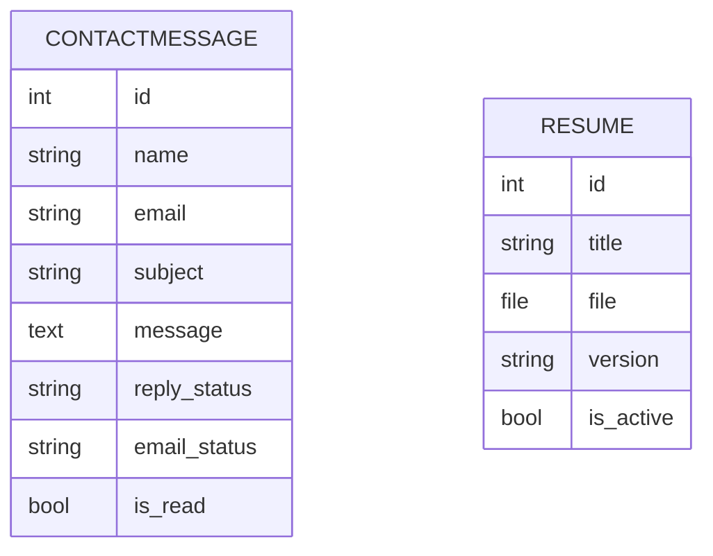
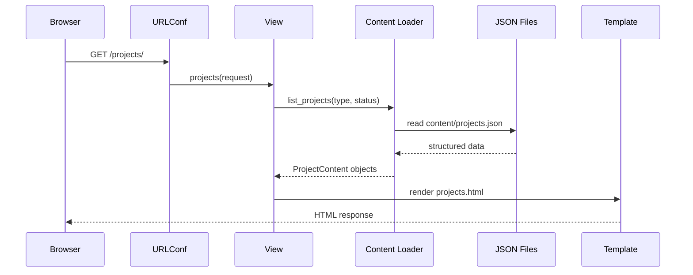
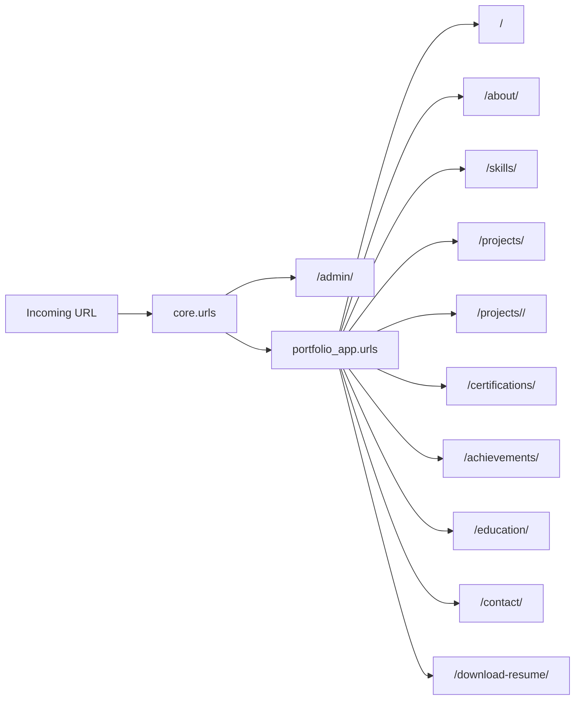
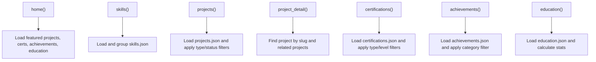
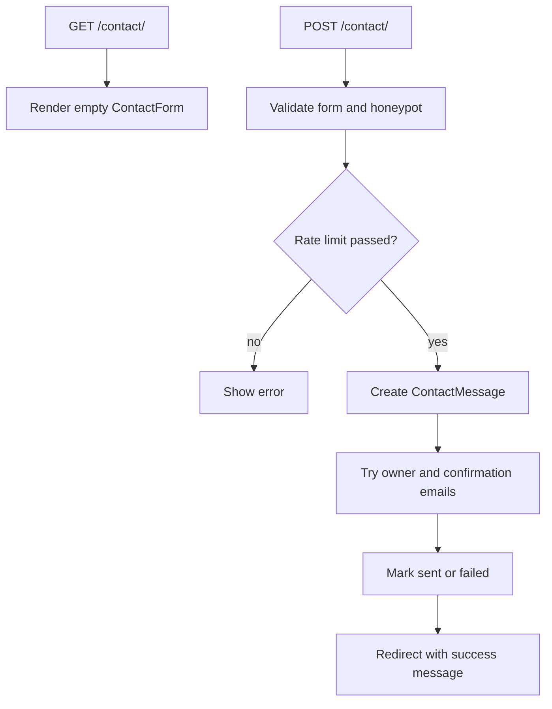
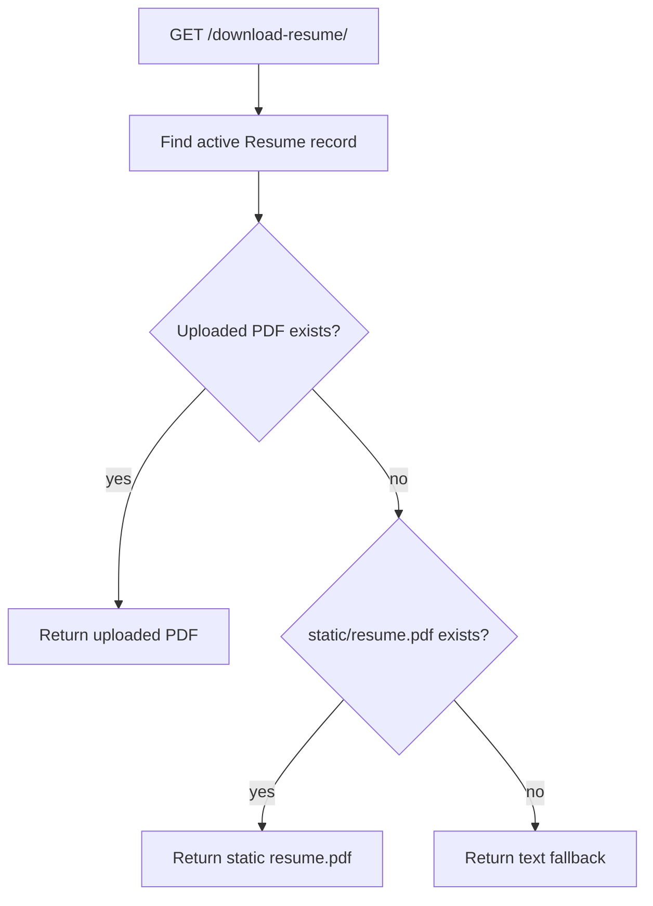
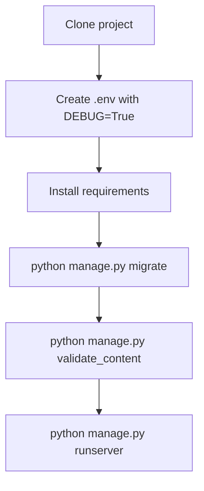

# Django Portfolio Project Workflows

Quick workflow reference for explaining the current project architecture.

## 1. Overall Architecture

```mermaid
flowchart TB
    User["Browser user"] --> Vercel["Vercel deployment"]
    Vercel --> Entry["api/wsgi.py"]
    Entry --> WSGI["core.wsgi.application"]
    WSGI --> URLs["Django URL resolver"]
    URLs --> Views["portfolio_app.views"]
    Views --> Loader["content_loader.py"]
    Loader --> Files["content/*.json"]
    Views --> ORM["Django ORM"]
    ORM --> DB["Database: admin, contact messages, resumes"]
    Views --> Templates["Django templates"]
    Templates --> Static["static CSS, images, resume fallback"]
    Templates --> User
```

## 2. Content Strategy

## 3. Database Boundary

The removed portfolio tables are no longer active application models. Migration
`0010_remove_database_backed_portfolio_content.py` keeps older databases
upgradeable by removing those old tables safely.

## 4. Request Response Lifecycle

## 5. URL Routing Map

## 6. Page Workflows

## 7. Contact Form Workflow

## 8. Resume Download Workflow

## 9. Local Setup Workflow

## 10. Interview Pitch

This is a Django portfolio with a file-based content system. Static portfolio
sections are loaded from JSON files, so the project avoids unnecessary database
tables for content that changes with code. The database is still used where it
adds value: contact messages, admin authentication, and resume uploads.
